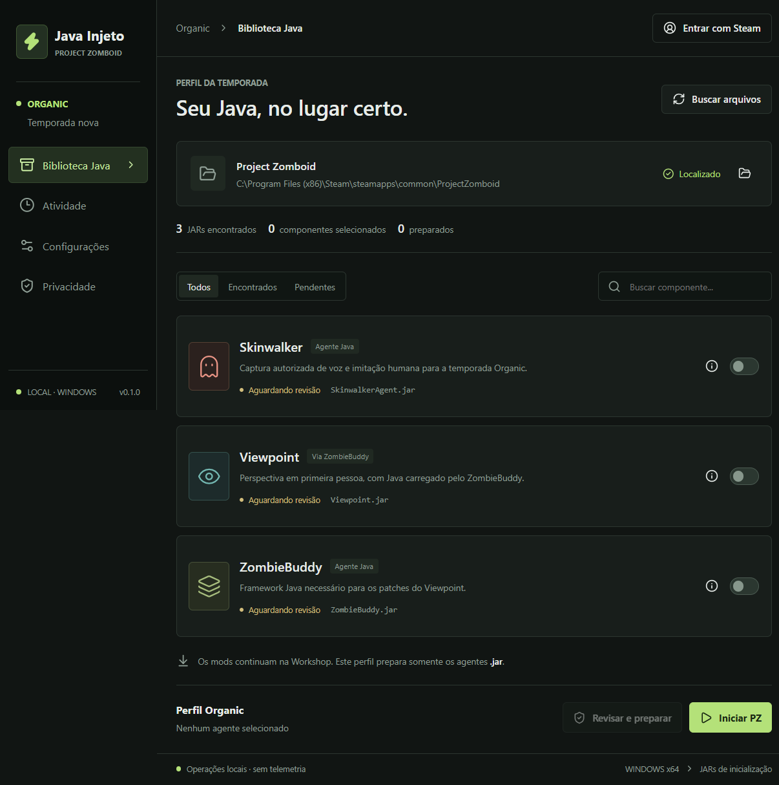

# Java Injeto - PZ

**Launcher desktop open source, em português brasileiro, para iniciar o Project Zomboid com agentes Java sem instalar arquivos manualmente na pasta do jogo.** Projeto independente da Organic / DuckStudio, com referência inicial na B42.21 e suporte atual a Windows x64.

[Baixar versão de testes](https://github.com/gamerplay20p5-dotcom/java-injeto-pz/releases/tag/v0.1.0) · [Manual PTBR](README_PTBR.md) · [Reportar problema](https://github.com/gamerplay20p5-dotcom/java-injeto-pz/issues) · [Licença MIT](LICENSE)



## O Que Ele Faz

- Localiza o PZ, bibliotecas Steam e componentes Java já instalados.
- Mostra origem, dependências e SHA-256 antes de pedir autorização para preparar os agentes.
- Mantém cópias dos agentes em uma pasta própria e inicia o cliente usando o Java que acompanha o PZ.
- Exige nova revisão quando um JAR muda e permite remover apenas as cópias feitas pelo launcher.
- Oferece temas claro/escuro, configurações locais e login Steam opcional pelo navegador.

**Os mods completos continuam sendo baixados pela Workshop.** O repositório e o executável não incluem JARs, Lua, mapas, modelos, texturas ou DLLs de mods. Não substituímos arquivos vanilla, opções de inicialização Steam ou saves. O launcher não injeta em um processo já aberto: inicia uma nova JVM com `-javaagent`.

## Usar Sem Programar

1. Baixe os mods e suas dependências pela Workshop. Skinwalker ainda exige uma cópia local autorizada enquanto não houver publicação confirmada.
2. Abra a Steam, feche o PZ e baixe `Java-Injeto-PZ-0.1.0-Windows.exe` nos [arquivos da versão](https://github.com/gamerplay20p5-dotcom/java-injeto-pz/releases/tag/v0.1.0).
3. Abra o launcher e clique em **Buscar arquivos**. Se necessário, selecione a instalação do PZ nas Configurações.
4. Selecione os componentes, clique em **Revisar e preparar**, confira os arquivos e autorize.
5. Use **Iniciar PZ** no launcher. Ative os mods normalmente dentro do jogo ou conecte ao servidor que os exige.

Não precisa instalar Node.js para usar o executável. O botão Jogar da Steam e os atalhos antigos não recebem o perfil deste launcher. Para deixar de usar o perfil, feche o jogo e volte à inicialização vanilla; instalações manuais antigas não são desfeitas automaticamente.

**Versão inicial de testes:** o executável ainda não tem assinatura de código. Não desative antivírus para executá-lo. Confira procedência e `SHA256SUMS.txt`; um hash identifica o arquivo, mas não garante que ele seja seguro. Login Steam real e partidas SP/MP ainda precisam de homologação.

## Componentes Disponíveis

| Componente | Como o launcher trata | Dependência |
| --- | --- | --- |
| Skinwalker | Prepara `SkinwalkerAgent.jar` como agente independente | Nenhuma |
| [Viewpoint](https://steamcommunity.com/sharedfiles/filedetails/?id=3809306528) | Mantém o JAR na Workshop para o framework carregar | ZombieBuddy |
| [ZombieBuddy](https://steamcommunity.com/sharedfiles/filedetails/?id=3619862853) | Prepara `ZombieBuddy.jar` com aprovação `policy=prompt` | Nenhuma |

`Viewpoint.jar` **não** pode ser usado diretamente como `-javaagent`. Suas assinaturas e estrutura original permanecem na Workshop. Na combinação atual, Skinwalker entra antes de ZombieBuddy, independentemente da ordem dos cliques.

O catálogo não é um instalador universal para qualquer JAR. Novos componentes precisam de análise e configuração: [como cadastrar agentes](docs/NOVOS_AGENTES_PTBR.md).

## Privacidade e Segurança

Não há telemetria, backend próprio, upload automático de logs ou gravação de voz pelo launcher. Preferências, caminhos e hashes ficam no computador. A exportação de diagnóstico é manual e pode conter o nome do usuário Windows nos caminhos: revise antes de compartilhar.

O login Steam é opcional, abre o navegador oficial e mantém o SteamID apenas na memória da sessão. O aplicativo não pede senha, Steam Guard, chave de API, amigos ou biblioteca. Esse login não confirma propriedade do jogo e não controla acesso ao servidor.

Agentes Java executam com as permissões do usuário: **use apenas fontes confiáveis**. O launcher não isola nem certifica o código dos mods. Recursos de voz ou coleta de dados dos próprios mods não pertencem a este aplicativo. Consulte [Privacidade](docs/PRIVACIDADE_PTBR.md) e [Segurança](SECURITY.md).

## Compilar o Código

Use Windows x64, Node.js 24 e npm. Para rodar testes unitários ou compilar a interface não é necessário instalar PZ ou ter uma conta Steam.

```powershell
git clone https://github.com/gamerplay20p5-dotcom/java-injeto-pz.git
cd java-injeto-pz
npm ci
npm test
npm run build
npm start
```

Para gerar a distribuição Windows:

```powershell
npm run dist
```

O portátil fica em `release/`. `npm run pack` gera a pasta `release/win-unpacked`. O código não contém os JARs dos mods: instale-os separadamente para testar a integração. `npm run dev` é apenas uma prévia visual no navegador, sem operações nativas.

## Testes e Organização

| Comando | Escopo | Requisitos adicionais |
| --- | --- | --- |
| `npm test` | 38 regressões de catálogo, arquivos, perfil e OpenID com resposta Steam simulada | Nenhum jogo ou credencial |
| `npm run build` | Compilação React/Vite | Nenhum jogo |
| `npm run test:ui` | Electron real, descoberta, revisão e preparação sem abrir o jogo | PZ e componentes locais do catálogo |
| `npm run test:agents` | Entrada dos agentes na JVM, usando apenas `java -version` | PZ, Skinwalker e ZombieBuddy locais |
| `npm run test:package` | Interface empacotada, isolamento, licença e hash do portátil | `npm run dist`, PZ local |

O CI verifica os testes unitários e a compilação no Windows. **Não valida uma partida**, VOIP ou sincronização MP; os testes de integração dependem de instalações locais e não rodam no CI. Veja [resultados e roteiro manual](docs/TESTES_PTBR.md).

```text
src/main/          Descoberta, validação de JAR, perfis, Steam e execução
src/preload.cjs    Ponte restrita entre interface e sistema
src/renderer/     Interface PTBR em React
catalog.json      Componentes conhecidos e dependências
tests/            Regressões sem arquivos de mods
tools/            Validações locais de interface, agentes e pacote
docs/             Arquitetura, privacidade e orientação de continuidade
```

## Documentação e Contribuições

- [Manual completo e problemas comuns](README_PTBR.md)
- [Arquitetura e explicação do código](docs/ARQUITETURA_PTBR.md)
- [Continuação com IA e próximos passos](docs/CONTINUAR_COM_IA_PTBR.md)
- [Adicionar componentes Java](docs/NOVOS_AGENTES_PTBR.md)
- [Como contribuir](CONTRIBUTING.md)
- [Reportar vulnerabilidades em privado](SECURITY.md)
- [Créditos e dependências](docs/TERCEIROS_PTBR.md)

## Licença e Créditos

O código deste launcher é distribuído sob a [licença MIT](LICENSE), permitindo uso, estudo, modificações e redistribuição com preservação do aviso de licença. Mods e bibliotecas de terceiros mantêm suas próprias licenças; MIT não autoriza redistribuir arquivos de mods ou do PZ.

Project Zomboid pertence à The Indie Stone; Steam pertence à Valve. ZombieBuddy é desenvolvido por zed-0xff e colaboradores; Viewpoint pertence aos autores da publicação original. Este projeto não é oficial nem afiliado a essas equipes.
